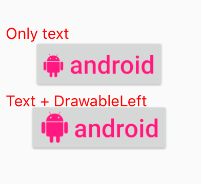

Set an image as drawableLeft on Button with using Icon Font (Iconics)
===========

[](https://developer.apple.com/iphone/index.action)
[](https://developer.apple.com/swift)
[](http://mit-license.org)

# Overview
Icon Font allows you to display icon images in text with ease.
However, it is difficult to use different sizes for text and icon.
By using the drawableLeft and drawableRight attributes on Android buttons, we can set an icon in button.
So I will explain how to display icon on drawableLeft using icon font.

In the sample, [Iconics](https://github.com/mikepenz/Android-Iconics) is adopted as a library for using Icon Font.

## How to use?
In the sample, drawable_icon_font_left attribute is set as shown below, and an image is generated from the icon font and displayed.

```xml
<Button
    android:text="{faw-android} android"
    />
<Button
    android:text="android"
    app:drawable_icon_font_left="@{`faw_android`}"
    />
```



## Author

**R. Ayakix**

- Past works: [Product list](http://ayakix.com/) / [Waaaaay!](http://waaaaay.com/)
- Blogs: [English](https://medium.com/@Ayakix) / [Japanese](http://blog.ayakix.com/)
- Contact: [Twitter](https://twitter.com/ayakix)
